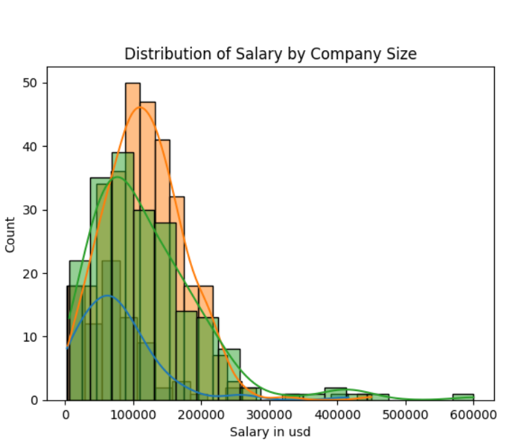
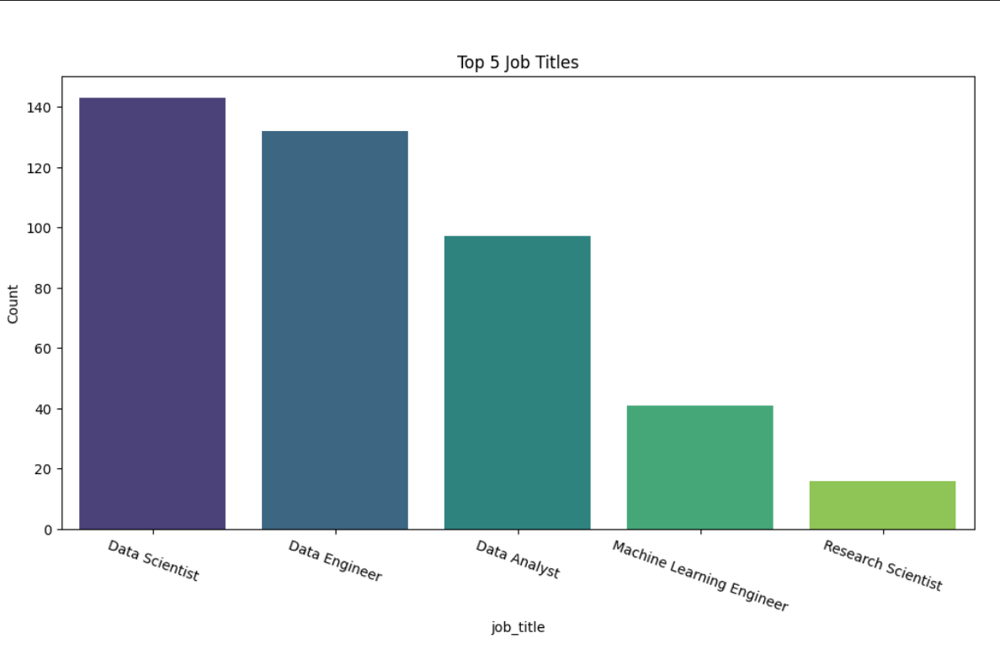
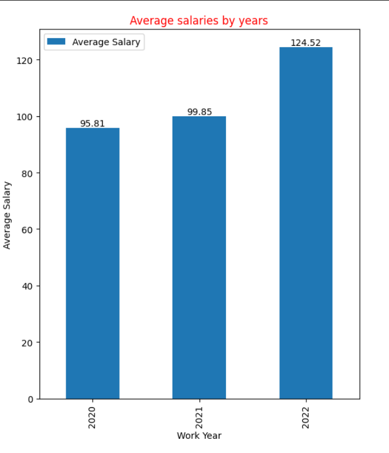

# Python Pandas Data Analysis Project

This project aims to perform a data analysis in the field of data science using the Python Pandas library. The dataset used in this project is sourced from [https://github.com/Rruhid/data](https://github.com/Rruhid/data).

## Project Objectives
- Loading and exploring the dataset
- Data manipulation and grouping
- Performing in-depth analysis
- Creating informative graphs

## Project Steps
1. Downloading the dataset from [https://github.com/Rruhid/data](https://github.com/Rruhid/data)
2. Loading and exploring the dataset
3. Cleaning the data and performing preprocessing steps
4. Grouping the data and creating summary statistics
5. Creating various graphs for data visualization

## Technologies Used
- Python
- Pandas
- Matplotlib
- Numpy
- Seaborn
- Jupyter Notebook

## Project Images

*Figure 1: illustrates the distribution of salaries based on company size. The histogram displays salary ranges for small, medium, and large companies, showing the distribution of salaries across different company sizes.*

*Figure 2: illustrates the top 5 most popular job titles. The horizontal bar plot visualizes the frequency of each job title, indicating how many times each title appears. This visualization is helpful for comparing the frequency of different job titles.*

*Figure 3: This graph visualizes the average salaries based on the years of work experience. The bar chart shows the average salary for each work year category, with labels indicating the exact average salary value. This visualization helps in understanding how average salaries vary with years of work experience.*

## How to Get Started?
Clone the project and run it in Jupyter Notebook or Python environment. You can add your project files to this repository and perform your own analysis.
